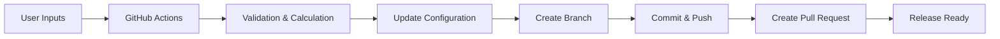

# 👋 Hi, I'm Sahana Ghosh

**DevOps & Cloud Engineer | CI/CD Automation | GitHub Actions | AI-Assisted Engineering**

DevOps & Cloud Engineering professional with **11+ years of experience**, specializing in **CI/CD modernization, cloud automation, Kubernetes, and AI-assisted DevOps**. I build automation that turns complex, manual release processes into **repeatable GitHub Actions workflows**.

---

## 🚀 Featured Project — Release Automation

### ⚙️ AI-Assisted Release Configuration Automation

A GitHub Actions-based automation designed to simplify complex release preparation that previously required manually updating **10+ JSON/YAML configuration files**.

The workflow takes a small set of inputs and automatically:

### What it automates

| Automation                      | Purpose                                                      |
| ------------------------------- | ------------------------------------------------------------ |
| 🔧 **Configuration Automation** | Dynamically updates service-specific JSON/YAML configuration |
| 🧮 **Release Calculation**      | Applies deployment-specific calculations and parameters      |
| 🌿 **Branch Automation**        | Creates and manages release branches automatically           |
| 📦 **Commit & Push**            | Validates, commits and pushes generated changes              |
| 🔀 **Pull Request Automation**  | Automatically creates a PR for review and deployment         |

### Key Benefits

* ⚡ Reduces repetitive release preparation
* 🛠️ Eliminates manual updates across multiple configuration files
* ✅ Reduces configuration errors
* 🔄 Standardizes the release process
* 📈 Improves release velocity and engineering productivity
* 🤖 Uses AI-assisted development to accelerate automation delivery

---

## 📂 Automation Examples

Explore the individual GitHub Actions workflows and configuration examples:

* [`release-automation.yml`](./.github/workflows/release-automation.yml) — Main release automation workflow
* [`config-update.yml`](./.github/workflows/config-update.yml) — Automated configuration updates
* [`branch-automation.yml`](./.github/workflows/branch-automation.yml) — Automated branch creation
* [`pr-automation.yml`](./.github/workflows/pr-automation.yml) — Automated pull request creation
* [`validation.yml`](./.github/workflows/validation.yml) — Configuration and workflow validation

> These examples represent the automation patterns used in the project. Production implementation details may be simplified or anonymized.

### 🔗 Project

**Release Automation Repository:**
[View Repository →](https://github.com/saghosh8/release-automation)

**GitHub Actions Workflows:**
[View Workflows →](https://github.com/saghosh8/release-automation/actions)

---

## 🧰 Technology

`GitHub Actions` · `Python` · `YAML` · `JSON` · `Git` · `GCP` · `Kubernetes` · `Bash` · `Ansible` · `AI-Assisted Engineering`

---

## 📜 Certifications

[View My Certifications →](https://github.com/saghosh8/CERTIFICATES)

---

## 🔗 Connect

[LinkedIn](https://www.linkedin.com/in/ghoshsahana/) · [GitHub](https://github.com/saghosh8) · [Email](mailto:sahanaghosh8@gmail.com)

---

⭐ **Explore my repositories to see practical examples of DevOps, CI/CD, cloud automation and AI-assisted engineering.**
